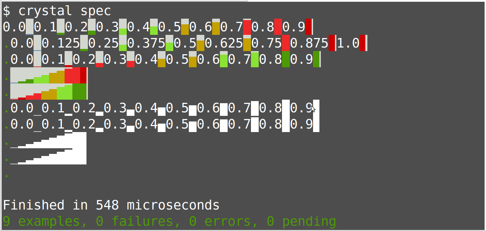

# ascii_bar_charter

Travis status: [](https://travis-ci.com/drhuffman12/ascii_bar_charter)

<!-- CircleCI status: [](https://circleci.com/gh/drhuffman12/ascii_bar_charter) -->

[](https://GitHub.com/drhuffman12/ascii_bar_charter.js/releases/)

This is a ASCII character-based bar char generator, with optional value prefix (of given precision) and optional colorization (red/green gradations).

## Installation

1. Add the dependency to your `shard.yml`:

   ```yaml
   dependencies:
     ascii_bar_charter:
       github: your-github-user/ascii_bar_charter
   ```

2. Run `shards install`

## Usage

```crystal
require "ascii_bar_charter"
```

Generate a B/W barchart of values with associated value as a prefix:

```crystal
  min = 0.0
  max = 1.0
  precision = 2.to_i8
  in_bw = true
  data = [0.0, 0.1, 0.2, 0.3, 0.4, 0.5, 0.6, 0.7, 0.8, 0.9]
  prefixed = true
  reversed = false

  charter = AsciiBarCharter.new(min, max, precision, in_bw, reversed)
  plot = charter.plot(data, prefixed)

  puts plot
```

This will look like:

```
0.0_0.1▁0.2▂0.3▃0.4▄0.5▅0.6▆0.7▇0.8█0.9▉
```

For other examples, see the tests.

## Testing

To run tests:

```crystal
crystal spec
```

It should look like:



## Contributing

1. Fork it (<https://github.com/your-github-user/ascii_bar_charter/fork>)
2. Create your feature branch (`git checkout -b my-new-feature`)
3. Commit your changes (`git commit -am 'Add some feature'`)
4. Push to the branch (`git push origin my-new-feature`)
5. Create a new Pull Request

## Contributors

- [Daniel Huffman](https://github.com/your-github-user) - creator and maintainer
